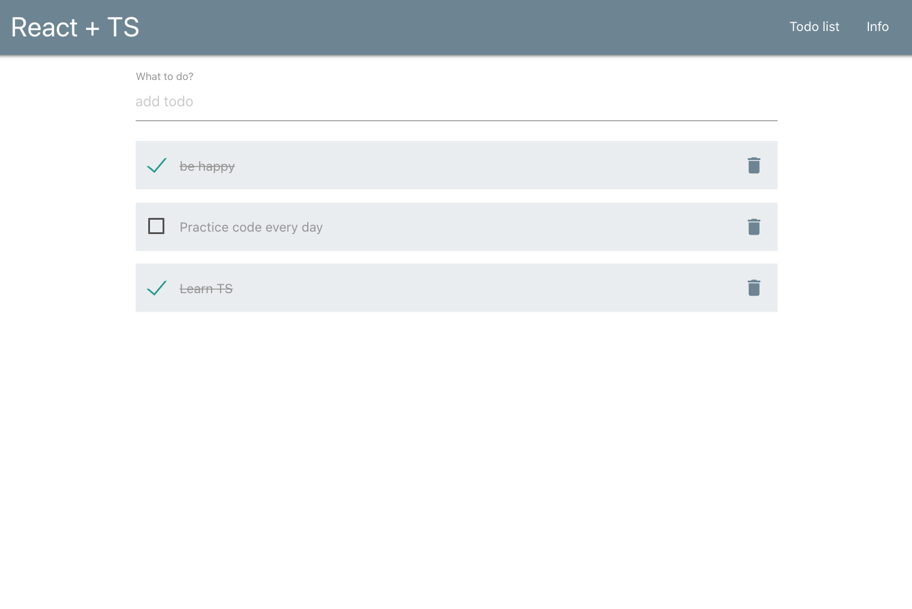

# Todo List

This is the simple study project on React and TypeScript

## Available Scripts

To run app

### `npm run build`
### `npm run start`

Runs the app in the development mode.\
Open [http://localhost:3000](http://localhost:3000) to view it in the browser.

The page will reload if you make edits.\

## :hammer_and_pick:Technologies

 
The following tecnologies were used to create this project:

- React

- TypeScript

- CSS

### Preview

 
 

